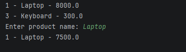
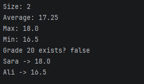
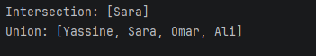
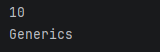
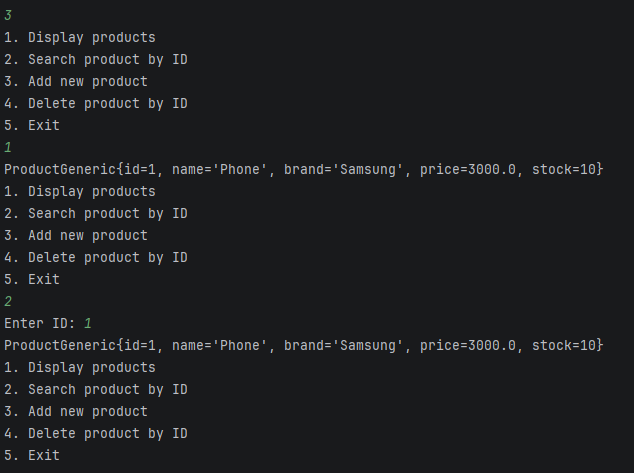

# Collections-Streams-and-Generics
**Author:** Imane Mekkaoui 
**Class:** 1-SDIA / 2025-2027 
**Project:** Practical Exercises on Collections, Streams, and Generics in Java

---

##  Project Description

This project demonstrates the use of **Java Collections (List, Map, Set), Streams, Lambda expressions, and Generics** through several hands-on exercises.  
The goal is to understand **how to store, manage, and manipulate objects** using Java OOP concepts and **generic programming**.

The exercises are divided into **two main parts**:

1. **Collections & Streams**
2. **Generics and OOP with a Product Management Application**

##  Exercises

### 1️ Collections & Streams

#### **1.1 Lists – ProductManagementApp**
- Created a Product class with attributes:
  - id (long)
  - name (String)
  - price (double)
- Implemented the following operations on an ArrayList of products:
  - Add products
  - Delete a product by index
  - Display all products
  - Modify a product by index
  - Search for a product by name (case-insensitive)

**Example Output:**

---

#### **1.2 Maps – StudentGrades**
- Created a HashMap<String, Double> storing student names and grades.
- Operations performed:
  - Insert grades
  - Increase a student's grade
  - Delete a grade
  - Display map size
  - Calculate average, maximum, and minimum grades
  - Check if a grade equals 20
  - Display all entries using forEach and lambda

**Example Output:**

---

#### **1.3 Sets – Groups**
- Created two HashSet<String> for groups A and B.
- Performed:
  - Add student names
  - Display **intersection**
  - Display **union**

**Example Output:**

---

###  Generics

#### **2.1 GenericStorage – Application**
  - Implemented a generic class GenericStorage<T> with:
  - addElement(T o) → Add an element
  - removeElement(int index) → Remove by index
  - getElement(int index) → Retrieve element
  - getSize() → Current size
- Tested with multiple types: Integer, String

**Example Output:**

---

#### **2.2 Generic OOP – Product Management**

- Created a **generic interface `IMetier<T>`** with methods:
  - `add(T o)`  
  - `List<T> getAll()`  
  - `T findById(long id)`  
  - `delete(long id)`

- Created `MetierProduitImpl` implementing `IMetier<ProductGeneric>`.

- Created a `ProductGeneric` class with attributes:
  - `id`, `name`, `brand`, `price`, `description`, `stock`

- Implemented `ApplicationMenu` with a **menu-driven console**:

**Menu:**

